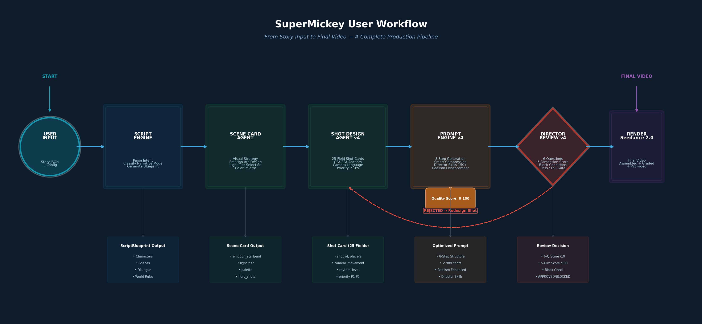
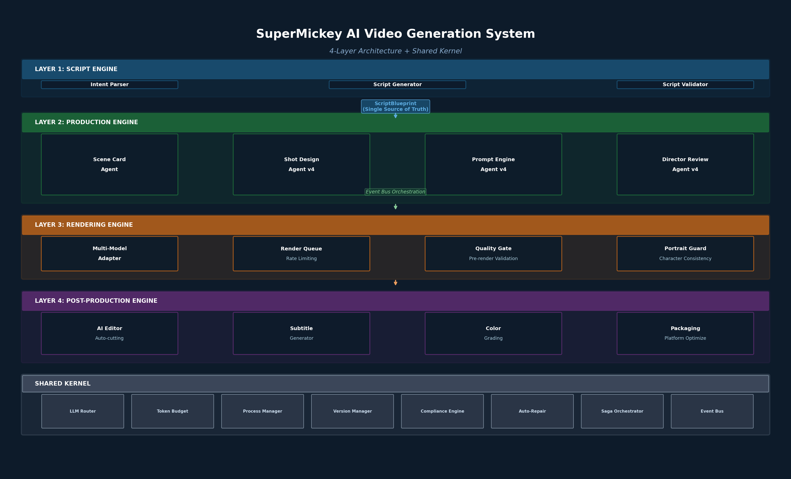

# SuperMickey AI Video Generation System

<p align="center">
  
</p>

<p align="center">
  <b>🎯 We Don't Sell Tools. We Deliver Business Results.</b><br/>
  <i>AI Video Content That Drives GMV, Traffic, and Brand Growth — Not Just Pretty Frames</i>
</p>

<p align="center">
  <a href="https://github.com/geniusdapeng-collab/super-mickey/stargazers"></a>
  <a href="LICENSE"></a>
  <a href="#"></a>
  <a href="#"></a>
  <a href="#"></a>
  <a href="#"></a>
</p>

> ⚠️ **Limited Beta** — Current version is time-limited open beta. Future versions may transition to paid or adjusted scope. Star and Fork now to lock in current version.
>
> 📈 **Want to see how SuperMickey drives real business growth?** Read our [**Business Value & Results Delivery Manifesto** →](./BUSINESS-VALUE.md)
>
> *Technology is not the destination. Business results are.*

---

## Table of Contents

- [What is SuperMickey?](#what-is-supermickey)
- [Why SuperMickey?](#why-supermickey)
- [🎯 Business Value: Results, Not Tools](#-business-value-results-not-tools)
- [System Architecture](#system-architecture)
- [The Four Production Agents](#the-four-production-agents)
- [25-Field Shot Card Standard](#25-field-shot-card-standard)
- [Quality Frameworks](#quality-frameworks)
- [Realism Enhancement Engine](#realism-enhancement-engine)
- [Quick Start](#quick-start)
- [AI Agent Integration](#ai-agent-integration)
- [Project Structure](#project-structure)
- [Configuration](#configuration)
- [Thematic Diversity System](#thematic-diversity-system)
- [Roadmap](#roadmap)
- [Contributing](#contributing)
- [💰 商业价值与前景](#-商业价值与前景)
- [License](#license)
- [👤 关于作者](#-关于作者)

---

## What is SuperMickey?

**SuperMickey** is a production-grade AI video generation system. But here's what that actually means:

> **We don't just generate videos. We deliver business results.**
>
> For e-commerce sellers, that means **3-5x conversion rate improvement** and **30%+ GMV growth**.
> For MCN agencies, that means **doubling matrix traffic** and **10x content output**.
> For brands, that means **Campaign ROI jumping from 1:3 to 1:8**.

Under the hood, SuperMickey is built on a **4-layer architecture** with **4 specialized AI agents**, treating video production as a software engineering problem — with strict quality gates, versioned checkpoints, automated reviews, and structured data contracts between every pipeline stage.

The system currently powers the **Nirath** cinematic universe (a hyper-realistic sci-fi world inspired by ancient mythology) and supports **11 thematic genres** ranging from cinematic drama to educational content, commercial marketing, travel vlogs, and more.

### 📖 Read the full business value proposition: [BUSINESS-VALUE.md](./BUSINESS-VALUE.md)

### At a Glance

| Metric | Value |
|--------|-------|
| **Lines of Code** | 206,000+ |
| **Files** | 787 modules |
| **Architecture Layers** | 4 + Shared Kernel |
| **Specialized Agents** | 4 production agents |
| **Shot-Level Fields** | 25 structured fields |
| **Quality Dimensions** | 5-dimension scoring |
| **Hollywood Director Skills** | 150+ cinematography skills |
| **Realism Dimensions** | 7-dimensional enhancement |
| **Thematic Genres** | 11 types |
| **Narrative Modes** | dramatic / educational / documentary / commercial / lifelog |

> **Built for AI Agents, engineered for humans.** Every module is designed to be programmatically discoverable, executable by autonomous agents, and human-reviewable at every stage.

---

## Why SuperMickey?

### The Problem with AI Video Today

Most AI video tools give you a text box and pray. Professional creators need:

- **Character consistency** across every shot — same face, same outfit, same essence
- **Camera continuity** — screen direction chains, OFA/EFA anchors, smooth transitions
- **Emotion arcs** that build across scenes, not random beautiful frames
- **Quality assurance** before rendering costs are sunk
- **Structured output** that can be versioned, diffed, and automated
- **Cinematic realism** — film grain, natural lighting, shallow depth of field

### The SuperMickey Solution

A **complete pre-production pipeline** that mirrors real film production:

```
User Intent → Script Blueprint → Scene Cards → Shot Cards → Prompts → Director Review → Render
```

Every stage produces **structured, reviewable artifacts** — not black-box outputs. Every shot is defined by 25 fields. Every shot passes a 6-question director review. Every prompt is optimized through an 8-step pipeline with smart compression, followed by a **FieldContentRefiner** post-assembly pass (v2.2-refine) that strips redundant clauses, merges negative constraints, and standardizes empty-shot fields — cutting typical prompts from ~2700 to ~1500 characters without quality loss.

<p align="center">
  
</p>

<p align="center">
  <i>From Story Input to Final Video — A Complete Production Pipeline</i>
</p>

---

## 🎯 Business Value: Results, Not Tools

**The fundamental shift in the AI era: Nobody buys tools. They buy outcomes.**

SuperMickey is not just open-source software. It is the foundation of a **results-delivery business** that helps customers achieve measurable growth.

### What Results Do We Deliver?

| Customer Segment | The Result They Want | The Result We Deliver |
|-----------------|---------------------|----------------------|
| **Cross-border E-commerce** | Sell more products | 300 product videos/month, 3-5x conversion rate improvement |
| **MCN / Agencies** | More traffic & revenue | 500 videos/day, matrix traffic doubled |
| **Enterprise Brands** | Brand awareness & ROI | Campaign ROI improved from 1:3 to 1:8 |
| **Content Creators** | More fans & higher ad rates | Content quality breakthrough, 3x ad rate increase |

### Three Results-Delivery Models

```
┌────────────────────────────────────────────────────────────────┐
│  Model A: Fully-Managed Growth Service                         │
│  ├── We handle: Strategy → Content → Operations → Optimization │
│  ├── You handle: Brief, review data, payment                   │
│  └── Pricing: Base fee + performance share (1-10% of results)  │
├────────────────────────────────────────────────────────────────┤
│  Model B: Semi-Managed Content Supply                          │
│  ├── We handle: Bulk video production per your brief           │
│  ├── You handle: Operations, distribution, strategy            │
│  └── Pricing: Per video ($5-50) or monthly subscription        │
├────────────────────────────────────────────────────────────────┤
│  Model C: Performance Guarantee                                │
│  ├── We promise: Specific business metrics (GMV, traffic, ROI) │
│  ├── You handle: Data access, coordination                     │
│  └── Pricing: Pay only when results are achieved               │
└────────────────────────────────────────────────────────────────┘
```

### Example: E-commerce Growth

**Client**: Bluetooth earphone seller, monthly GMV $80K  
**Our Delivery**:
- Month 1: 200 product videos → GMV grows to $95K (+18%)
- Month 2: 300 videos + optimization → GMV grows to $110K (+37%)
- Month 3: Full SKU coverage → GMV grows to $125K (+56%)

**Pricing**: $3,000 base + 2% of incremental GMV = $4,000/month  
**Client ROI**: $4K input → $45K incremental GMV = **1:11.25**

👉 **Read the complete business value document:** [BUSINESS-VALUE.md](./BUSINESS-VALUE.md)

---

## System Architecture

### 4-Layer Architecture + Shared Kernel

<p align="center">
  
</p>

```
┌─────────────────────────────────────────────────────────────┐
│  Layer 1: Script Engine                                     │
│  ├─ Intent Parser → Narrative Mode Classification           │
│  ├─ Script Generator → Structured ScriptBlueprint JSON      │
│  ├─ Script Validator → Schema + Business Rules              │
│  └─ Output: Immutable ScriptBlueprint (Single Source of     │
│     Truth)                                                  │
├─────────────────────────────────────────────────────────────┤
│  Layer 2: Production Engine                                 │
│  ├─ Scene Card Agent → Visual/emotional strategy per scene  │
│  ├─ Shot Design Agent v4 → 25-field shot cards              │
│  ├─ Prompt Engine Agent v4 → 8-step optimized prompts       │
│  ├─ Director Review Agent v4 → 6-question + 5-dimension QA  │
│  └─ Event Bus Orchestration → Async agent collaboration      │
├─────────────────────────────────────────────────────────────┤
│  Layer 3: Rendering Engine                                  │
│  ├─ Multi-Model Adapter → Seedance 2.0 (extensible)         │
│  ├─ Render Queue → Batch submission with rate limiting       │
│  ├─ Quality Gate → Pre-render validation                    │
│  └─ Portrait Guard → Character consistency enforcement       │
├─────────────────────────────────────────────────────────────┤
│  Layer 4: Post-Production Engine                            │
│  ├─ AI Editor → Automated cutting & transitions             │
│  ├─ Subtitle Generator → Dialogue timing & burn-in          │
│  ├─ Color Grading → LUT application & tonal consistency      │
│  └─ Packaging → Title cards, end cards, platform optimize    │
├─────────────────────────────────────────────────────────────┤
│  Shared Kernel                                              │
│  ├─ LLM Router → Multi-model routing with fallback          │
│  ├─ Token Budget → API quota management                     │
│  ├─ Process Manager → Engine isolation & crash recovery      │
│  ├─ Version Manager → Checkpoint & snapshot at every stage   │
│  ├─ Compliance Engine → Content safety & policy enforcement  │
│  ├─ Auto-Repair Loop → Self-healing on failure patterns      │
│  ├─ Saga Orchestrator → Distributed transaction compensation │
│  └─ Event Bus → Async inter-agent communication              │
└─────────────────────────────────────────────────────────────┘
```

### Interface Contracts (5 IC Contracts)

| Contract | From → To | Data Model |
|----------|-----------|------------|
| **IC-1** | User → Script Engine | `UserIntent` — parsed narrative mode + metadata |
| **IC-2** | Script → Production | `ScriptBlueprint` — **single source of truth** |
| **IC-3** | Production → Rendering | `ShotPrompt` — prompt + reference images + render params |
| **IC-4** | Rendering → Post-Prod | `RenderedClip` — video + quality report |
| **IC-5** | Post-Prod → Output | `FinalVideo` — assembled video with packaging |

---

## The Four Production Agents

### Agent 1: Scene Card Agent

**Purpose:** Upstream visual and emotional strategy for entire scenes.

Generates a **Scene Card** that controls the visual direction for all shots in a scene:

| Field | Description |
|-------|-------------|
| `scene_function` | establish / advance / conflict / reveal / resolve |
| `emotion_start` → `emotion_end` | Emotional arc with turning point |
| `emotion_intensity` | 1-10 scale |
| `light_tier` | A (bright) / B (mystery) / C (contrast) / D (divine) |
| `primary_palette` + `accent_color` | Color strategy with color theory |
| `screen_direction` | Consistent screen movement direction |
| `continuity_mode` | strict / soft / none |
| `shot_count` | Recommended 3-8 shots |
| `hero_shots` | Identified hero shot positions |
| `_rhythmProfile` | Three-act narrative rhythm injection |

**Optimizations:** Integrates narrative rhythm engine (three-act structure), cinematography core (color theory), and breathing pattern design.

---

### Agent 2: Shot Design Agent v4

**Purpose:** Breaks scenes into individual shots with **25 structured fields**.

<p align="center">
  
</p>

**25 Field Categories:**

```javascript
// Core Identity
shot_id, scene_id, shot_type, priority (P1-P5), is_hero_shot

// Narrative
narrative_purpose, primary_action, performance_goal

// Visual Anchors
ofa (Opening Frame Anchor), efa (Ending Frame Anchor), primary_poi

// Camera
shot_size, camera_position, camera_movement, motion_intensity

// Rhythm
rhythm_level (静/缓/中/快/爆发), info_density, duration

// Space
spatial_relation, environment_traits, screen_direction

// Audio
dialogue, sound_events

// System
light_tier, color_temp, transition_intent, continuity_mode
character_bindings, scene_function
```

**Priority System:**

| Priority | Type | Retry Strategy |
|----------|------|----------------|
| **P1** | Hero Shot | Must succeed — maximum retries |
| **P2** | Key Narrative | High retry count |
| **P3** | Supporting | Standard retry |
| **P4** | Transition | Low retry, can simplify |
| **P5** | Replaceable | Skip if fails |

---

### Agent 3: Prompt Engine Agent v4

**Purpose:** Generate optimized, length-compliant render prompts.

**8-Step Structured Generation** (priority-ordered, steps 1/2/8 are sacred):

```
Step 1: Character Anchor      (HIGHEST — NEVER compressed)
Step 2: Primary Action        (HIGHEST — NEVER compressed)
Step 3: Performance Focus     (HIGH)
Step 4: Spatial Environment   (MEDIUM)
Step 5: Camera Language       (MEDIUM)
Step 6: Lighting & Material   (MEDIUM)
Step 7: Sound & Dialogue      (LOWER — first to compress)
Step 8: Closing Anchor        (HIGH — NEVER compressed)
```

**Smart Compression Pipeline** (triggered when exceeding subsystem max):
1. Remove sound/dialogue
2. Simplify lighting/material
3. Simplify camera language
4. Simplify environment
5. Remove performance focus

**Enhancement Systems Integrated:**
- **Cinematography Skill Router** — 150+ Hollywood director skills injected into prompts
- **Acting Emotion Skills** — Facial micro-expressions, body language, eye contact guidance
- **Cinematography Core** — Composition rules, color theory, lighting recommendations
- **Realism Enhancement** — Film grain, physical light simulation, natural skin texture

**Prompt Length Configuration** (by subsystem):

| Subsystem | TARGET_MIN | TARGET_MAX | HARD_MAX | Use Case |
|-----------|-----------|-----------|---------|---------|
| **SuperMickey** | 2,470 | 3,000 | 3,000 | Cinematic production, max detail |
| **Short-Video** | 1,400 | 1,500 | 1,500 | Short-form content, fast generation |

---

### Agent 4: Director Review Agent v4

**Purpose:** Automated quality assurance before rendering — the gatekeeper.

<p align="center">
  
</p>

**Six-Question Review Framework:**

| # | Question | Assessment |
|---|----------|------------|
| Q1 | Why does this shot exist? | Narrative purpose validation |
| Q2 | Where does the eye go first? | Primary point of interest check |
| Q3 | What story is lost if deleted? | Hero shot / priority verification |
| Q4 | Does the EFA naturally lead to next OFA? | Continuity chain validation |
| Q5 | Is there a simpler way to shoot? | Efficiency review |
| Q6 | Is it editable, not just pretty? | Post-production readiness |

**Five-Dimension Scoring:**

| Dimension | Weight | Description |
|-----------|--------|-------------|
| **Readability** | 25% | Subject/action recognizable in 3 seconds |
| **Controllability** | 20% | Historical success rate for this shot type |
| **Editability** | 20% | Clear anchor points for cutting |
| **Emotion Hit** | 20% | Matches scene emotion target |
| **Memorability** | 15% | Has "unforgettable" elements |

**Block Conditions** (hard stops — cannot render):
- Missing subject
- Camera/action conflict
- Missing OFA/EFA
- System violations (forbidden elements, character inconsistency)

**Enhanced Scoring (v4.2):**
- **Director 4-Dimension Optimization** — Story(30%) + Continuity(25%) + Visual(25%) + Style(20%)
- **Field Consistency Checker** — 25-field cross-validation with 20+ validation rules

---

## 25-Field Shot Card Standard

Every shot in SuperMickey is defined by **25 structured fields**. This standard enables:

- **Cross-model compatibility** — works with Seedance, Kling, Pika, Runway
- **Automated quality scoring** — every field is evaluable
- **Continuity validation** — OFA/EFA chains ensure smooth transitions
- **Agent-to-agent communication** — structured data between all agents

### Field Specification Table

| # | Field | Category | Priority | Description |
|---|-------|----------|----------|-------------|
| 1 | `shot_id` | Identity | required | Unique identifier (SC01-S01) |
| 2 | `scene_id` | Identity | required | Parent scene reference |
| 3 | `shot_type` | Identity | required | opening/hero/climax/close/building |
| 4 | `priority` | Identity | required | P1-P5 priority level |
| 5 | `is_hero_shot` | Identity | required | Flag for hero shots |
| 6 | `narrative_purpose` | Narrative | required | Why this shot exists |
| 7 | `primary_action` | Narrative | required | Main character action |
| 8 | `performance_goal` | Narrative | required | Emotional acting target |
| 9 | `ofa` | Visual Anchor | required | Opening Frame Anchor |
| 10 | `efa` | Visual Anchor | required | Ending Frame Anchor |
| 11 | `primary_poi` | Visual Anchor | required | First visual focus point |
| 12 | `shot_size` | Camera | required | wide/medium/close_up/extreme_close_up |
| 13 | `camera_position` | Camera | required | Camera placement description |
| 14 | `camera_movement` | Camera | required | Specific movement description |
| 15 | `motion_intensity` | Camera | required | Movement intensity 1-5 |
| 16 | `rhythm_level` | Rhythm | required | 静/缓/中/快/爆发 |
| 17 | `info_density` | Rhythm | required | 极简/低/中/高/极高 |
| 18 | `spatial_relation` | Space | required | Character-space relationship |
| 19 | `environment_traits` | Space | required | Key environment elements |
| 20 | `dialogue` | Audio | optional | Character dialogue |
| 21 | `sound_events` | Audio | optional | Key sound descriptions |
| 22 | `transition_intent` | System | required | How to connect to next shot |
| 23 | `light_tier` | System | required | A/B/C/D lighting tier |
| 24 | `screen_direction` | System | required | Screen movement direction |
| 25 | `character_bindings` | System | required | Character anchor features |

---

## Quality Frameworks

### Light Tier System

| Tier | Name | Use Case | Mood |
|------|------|----------|------|
| **A** | Bright Exploration | Discovery, wonder, journey | Curiosity, openness |
| **B** | Mystery Low-Light | Suspense, unknown, tension | Uncertainty, anticipation |
| **C** | Contrast High | Conflict, drama, action | Intensity, clash |
| **D** | Divine Presence | Revelation, climax, sacred | Awe, transcendence |

### Color Temperature Mapping

The system automatically maps emotional targets to professional color science:
- **Warm palette** (gold/amber) → Epic, hope, warmth
- **Cool palette** (blue/teal) → Mystery, technology, distance
- **Desaturated earth tones** → Realism, documentary, grounding
- **High contrast** → Drama, conflict, intensity

---

## Realism Enhancement Engine

> 本引擎为生产执行子系统，文中 v6.x 为其内部历史编号，与 SuperMickey 系统版本无关（系统版本以根目录 package.json 为准）。

### 7-Dimensional Realism Model（子系统内部编号 v6.6.0）

> **"Controlled imperfection is more real than perfection itself."**

| Dimension | Primary Values | Effect |
|-----------|---------------|--------|
| **Camera Body** | Arri Alexa 65, RED V-RAPTOR, Sony Venice 2 | Large format sensor look |
| **Lens System** | Cooke S7/i, Arri Master Prime, anamorphic 2.39:1 | Cinematic lens character |
| **Aperture & DOF** | f/1.8 - f/2.8, shallow DOF, soft bokeh | Natural depth separation |
| **Lighting** | Natural diffused overcast, soft shadows | Avoid "perfect" studio lighting |
| **Color Science** | Muted desaturated earth tones, teal shadows | Cinematic LUT aesthetic |
| **Material & Micro-Details** | Subsurface scattering, skin pores, hair strands | Physical texture realism |
| **Motion & Atmosphere** | Motion blur, wind, dust particles, handheld shake | Natural movement imperfection |

### Anti-Pattern Replacements

| AI-Looking Phrase | Replacement |
|-------------------|-------------|
| `perfect skin` | `skin pores visible, subtle imperfections` |
| `vivid colors` | `muted desaturated earth tones` |
| `studio lighting` | `natural diffused overcast lighting` |
| `everything in sharp focus` | `shallow DOF, f/1.8` |
| `clean digital look` | `subtle film grain, organic texture` |
| `cinematic` (alone) | `Arri Alexa 65, Cooke S7/i lenses` |
| `static pose` | `natural micro-movements, wind blowing hair` |

---

## Thematic Diversity System

SuperMickey supports **11 thematic genres**, each with dedicated validation rules, prompt strategies, and dialogue timing:

| Code | Genre | Description |
|------|-------|-------------|
| **EDU** | Educational | Knowledge delivery, explainer videos |
| **DOC** | Documentary | Real-world narratives, interviews |
| **FAMILY** | Family Gathering | Home videos, celebrations |
| **MARKETING** | Commercial Marketing | Brand content, product showcases |
| **CINE** | Cinematic Drama | Narrative films, storytelling |
| **ART** | Artistic | Experimental, visual poetry |
| **VFX** | Visual Effects | CGI-heavy, spectacle content |
| **TRAVEL** | Travel Vlog | Destination content, exploration |
| **FOOD** | Food & Culinary | Cooking, gastronomy |
| **FITNESS** | Fitness & Sports | Workout, athletic content |
| **KIDS** | Children's Content | Age-appropriate storytelling |

Each genre automatically adjusts:
- **Dialogue-to-shot timing** (EDU extends shots for complete dialogue)
- **Prompt tone and vocabulary**
- **Validation rules** (content safety, style consistency)
- **Rhythm patterns**

---

## Quick Start

### Prerequisites

```bash
# Node.js 24+ (required for native fetch, structuredClone)
node --version  # >= 24.0.0

# API Keys (set as environment variables)
export ARK_API_KEY="your-volcengine-api-key"
export KIMI_API_KEY="your-llm-api-key"
```

### Installation

```bash
git clone https://github.com/geniusdapeng-collab/super-mickey.git
cd super-mickey
npm install
```

### Configuration

```bash
# Copy example env file
cp .env.example .env

# Edit .env with your API keys
# ARK_API_KEY=your-api-key
# SEEDANCE_ENDPOINT=your-endpoint-id
# SEEDREAM_ENDPOINT=your-image-endpoint-id
```

### Run Pre-Production Pipeline

```bash
# Create a story input
mkdir -p stories
cat > stories/my-story.json << 'EOF'
{
  "title": "Mountain Adventure",
  "narrative_mode": "dramatic",
  "target_duration": 60,
  "target_platform": ["youtube", "tiktok"],
  "language": "en-US",
  "style_tags": ["cinematic", "epic", "hyper-realistic"],
  "protagonist": "alex",
  "plot": "A mountaineer faces a sudden storm and must find shelter",
  "scenes": [
    {
      "scene_name": "The Ascent",
      "location": "rocky mountain trail",
      "characters": ["alex"],
      "plot": "Alex climbs steadily, enjoying the view",
      "emotion_target": "wonder"
    },
    {
      "scene_name": "The Storm",
      "location": "mountain ridge",
      "characters": ["alex"],
      "plot": "Dark clouds gather, wind intensifies",
      "emotion_target": "fear"
    }
  ]
}
EOF

# Run pre-production
node app/cli.js preproduction --input stories/my-story.json

# Output will be in ./output/:
# - scene-cards/      (visual strategy per scene)
# - shot-cards/       (individual shot designs with 25 fields)
# - prompts/          (render-ready optimized prompts)
# - reviews/          (director review reports with scores)
```

### Programmatic Usage

```javascript
const { SceneCardAgent } = require('./agents/scene-card-agent');
const { ShotDesignAgentV4 } = require('./agents/shot-design-agent-v4');
const { PromptEngineAgentV4 } = require('./agents/prompt-engine-agent-v4');
const { DirectorReviewAgentV4 } = require('./agents/director-review-agent-v4');

// Step 1: Generate Scene Card
const sceneAgent = new SceneCardAgent();
const sceneCard = await sceneAgent.generate({
  sceneName: 'The Storm',
  location: 'mountain ridge',
  characters: ['alex'],
  plot: 'Dark clouds gather, wind intensifies',
  emotionTarget: 'fear',
  duration: 20
});

// Step 2: Generate Shot Cards
const shotAgent = new ShotDesignAgentV4();
const shots = await shotAgent.generateShots(sceneCard);

// Step 3: Generate Prompts
const promptAgent = new PromptEngineAgentV4();
for (const shot of shots) {
  const result = await promptAgent.generate(shot, sceneCard);
  console.log(`Shot ${shot.shot_id}: ${result.charCount} chars, quality: ${result.quality.score}`);
}

// Step 4: Director Review
const director = new DirectorReviewAgentV4();
for (const shot of shots) {
  const review = await director.review(shot, sceneCard, [prevShot, nextShot]);
  console.log(`Shot ${shot.shot_id}: ${review.status} | Score: ${review.fiveDimensions.totalScore}`);
}
```

---

## AI Agent Integration

SuperMickey is designed for **AI Agent integration** via MCP (Model Context Protocol):

```javascript
// Register SuperMickey as MCP tools
server.registerTool("generate_scene_card", { ... });
server.registerTool("generate_shot_cards", { ... });
server.registerTool("generate_prompt", { ... });
server.registerTool("director_review", { ... });

// Full autonomous pipeline
const result = await runAutonomousPipeline(storyInput);
// Returns: { total, approved, avg_quality, ready_to_render }
```

**Agent Discovery Endpoint:**

```bash
curl http://localhost:3000/api/capabilities
# Returns system metadata, agent list, supported fields, quality dimensions
```

**AI-Friendly Metadata:**

```yaml
# agent-discovery.yaml
project:
  name: SuperMickey AI Video Generation System
  type: ai-video-generation-pipeline
  version: 2.2.2  # 统一以 package.json 为准

  agent_capabilities:
    - video_preproduction
    - script_generation
    - storyboard_generation
    - prompt_engineering
    - quality_assessment
    - render_coordination
    - character_consistency
    - director_review

  entry_points:
    cli: "node run-preproduction-iron-pot-star.js"
    programmatic: "require('./hyperreality-system/orchestration/super-mickey-saga-adapter.js')"

  dependencies:
    runtime: "Node.js >= 24"
    apis:
      - name: "Volcano Engine Seedance 2.0"
        purpose: "Video rendering"
        required: true
      - name: "Kimi K2-P6"
        purpose: "LLM inference"
        required: true
        swappable: true
        alternatives: ["OpenAI GPT-4", "Anthropic Claude", "Any OpenAI-compatible API"]

  quality_guarantees:
    - "25+ field definitions for shot-level control"
    - "5-dimension quality scoring framework"
    - "Character consistency via 4-angle portraits"
    - "Saga compensation on any stage failure"
    - "Director agent reviews and optimizes output"
```

---

## Project Structure

```
supermickey/
├── agents/                          # 4 Specialized AI Agents
│   ├── director-review-agent-v4.js  # Quality assurance agent
│   ├── prompt-engine-agent-v4.js    # Prompt generation agent
│   ├── scene-card-agent.js          # Visual strategy agent
│   └── shot-design-agent-v4.js      # Shot design agent
├── app/                             # CLI Entry Point
│   ├── cli.js                       # Command-line interface
│   └── commands/
│       └── preproduction.js         # Full pipeline command
├── architecture-v2/                 # Interface Contracts
│   └── interface-contract-v1.md     # 4-layer IC specification
├── config/                          # Configuration
│   ├── production-bible.js          # Project knowledge base
│   ├── prompt-length.js             # Length constraints
│   ├── theme-config.js              # 11-genre theme configuration
│   ├── quality-dimensions.js        # Quality scoring config
│   └── degradation-matrix.js        # Graceful degradation rules
├── core/                            # Core Infrastructure
│   ├── event-bus.js                 # Async agent communication
│   ├── saga-orchestrator.js         # Distributed transactions
│   ├── llm-gateway.js               # LLM routing & fallback
│   ├── immutable-shot.js            # Immutable shot records
│   ├── prompt-assembly-engine.js    # Prompt construction
│   ├── render-quality-loop.js       # Quality feedback loop
│   └── visual-continuity-engine.js  # Continuity tracking
├── systems/                         # Production Systems
│   ├── llm-reasoning-engine.js      # LLM abstraction layer
│   ├── production-bible.js          # Knowledge base loader
│   ├── light-tier.js                # Lighting classification
│   ├── quality-scorer.js            # 5-dimension scoring
│   ├── continuity-manager.js        # Shot continuity
│   ├── prompt-guardian.js           # Auto prompt repair
│   ├── preproduction-service.js     # Pipeline orchestrator
│   ├── realism-prompt-enhancer.js   # 7-dim realism engine
│   ├── camera-movement-system.js    # 6-base camera movements
│   └── compliance-checker.js        # 3-level content safety
├── templates/                       # Output Templates
│   ├── scene-card-template.md
│   ├── shot-card-v4-template.md
│   └── director-review-form.md
├── characters/                      # Character Reference Images
├── stories/                         # Story Inputs (JSON)
└── output/                          # Generated Artifacts
```

---

## Configuration

### Production Bible

The `ProductionBible` is the central knowledge base for your project:

```javascript
// config/production-bible.js
{
  project: {
    name: "Mountain Adventure",
    style: "cinematic documentary",
    aspect_ratio: "16:9",
    resolution: "1080p"
  },
  characters: {
    alex: {
      name: "Alex Chen",
      role: "protagonist",
      anchorFeatures: ["short black hair", "hiking gear", "determined eyes"],
      variationAllowed: ["expression", "posture", "lighting"],
      variationForbidden: ["age change", "outfit color drift"]
    }
  },
  forbidden: ["text", "watermark", "logo", "extra limbs", "distorted"]
}
```

---

## Roadmap

### Current（当前版本以根目录 package.json 为准）
- [x] 4 production agents operational
- [x] 25-field shot card standard
- [x] 5-dimension quality scoring
- [x] 6-question director review
- [x] 8-step prompt generation with smart compression
- [x] 150+ Hollywood cinematography skills
- [x] 7-dimension realism enhancement
- [x] 11 thematic genres
- [x] 4-layer architecture with interface contracts
- [x] Saga orchestration with crash recovery
- [x] Content compliance (3-level checking)

### v7.0 (In Design)
- [ ] Independent Script Engine (single source of truth)
- [ ] Multi-model render adapters (Kling, Pika, Runway)
- [ ] Post-production engine (AI editing, grading)
- [ ] MCP server with full tool coverage
- [ ] Web dashboard for visual pipeline monitoring

### v8.0 (Future)
- [ ] Real-time collaboration between human directors and AI agents
- [ ] Custom director style training
- [ ] Automated A/B testing for shot variations
- [ ] Multi-language dubbing with lip-sync

---

## Contributing

We welcome all forms of contribution! See [CONTRIBUTING.md](CONTRIBUTING.md) for guidelines.

**Priority Areas for Contributors:**

| Area | Skill Level | Description |
|------|-------------|-------------|
| Render Adapters | Intermediate | Add Kling/Pika/Runway adapters |
| MCP Tools | Intermediate | Expand MCP tool coverage |
| Documentation | Beginner | Translation, examples, tutorials |
| Quality Benchmarks | Advanced | Build evaluation datasets |
| Template Library | Beginner | Create scene templates |

**Architecture Principles:**
1. **Layered clarity** — new features belong to their Layer (0-4)
2. **Default disabled** — new modules default to `enabled: false`
3. **Degradation protection** — all external deps have timeout + exception handling
4. **Zero sensitive info** — never commit API keys, tokens, or credentials

---

## 💰 Business Value & Commercial Prospects

> **Technology is not the destination. Business results are.**
>
> SuperMickey is not just open-source code. It is the foundation of a **results-delivery business** that helps customers achieve measurable growth.

### Industry Pain Points We Solve

| Segment | Pain Point | Value Delivered |
|---------|-----------|----------------|
| **E-commerce Sellers** | Low video coverage → low conversion | 300 videos/month, 3-5x conversion improvement |
| **MCN Agencies** | Content bottleneck, stagnant growth | 10x output increase, matrix traffic doubled |
| **Brands** | Slow production, can't respond to trends | Campaign ROI from 1:3 to 1:8 |
| **Film Education** | Students lack practice opportunities | Zero-cost professional training |

### Market Opportunity

- AI video generation is at an inflection point, with 300%+ projected growth 2025-2027
- Multi-Agent orchestration is becoming the standard paradigm for video production
- Early movers will define industry standards and build ecosystem moats

### 📖 Full Business Value Document

For our complete results-delivery framework, pricing models, case studies, and revenue projections, see:

👉 **[BUSINESS-VALUE.md](./BUSINESS-VALUE.md)** — *We Don't Sell Tools. We Deliver Results.*

> **Limited Beta** — Experience full capabilities now. Lock in the open-source version by Starring and Forking.

---

## License

MIT License — see [LICENSE](LICENSE) for details.

Copyright (c) 2026 SuperMickey Contributors.

---

## 👤 关于作者

我是 **Genius（大鹏）**，AI 产品经理，痴迷于「用 AI 讲述伟大的故事」。

我相信 AI 视频不是「能看就行」，而是应该「触动人心」。从剧本到运镜，从角色到光影，每一个镜头都应该有导演的意志。

开源这四套系统，是希望更多人能站在巨人的肩膀上，把 AI 视频从「玩具」推向「工具」再推向「艺术品」。

> 一起驾驭想象力。

📮 **Genius · 63904380@qq.com**

---

## 🌍 About the Author

I'm **Genius**, an AI Product Manager obsessed with "using AI to tell great stories."

Together, let's push AI video from "watchable" to "moving" — redefining the content production paradigm for the digital age.

📮 **Genius · 63904380@qq.com**

---

<p align="center">
  <b>SuperMickey</b> — Engineered for the age of AI-generated cinema.<br/>
  <i>If you can script it, we can film it.</i>
</p>

<p align="center">
  <a href="https://github.com/geniusdapeng-collab/super-mickey">Star on GitHub</a> ·
  <a href="https://discord.gg/supermickey">Join Discord</a> ·
  <a href="https://twitter.com/supermickey">Follow on X</a>
</p>
