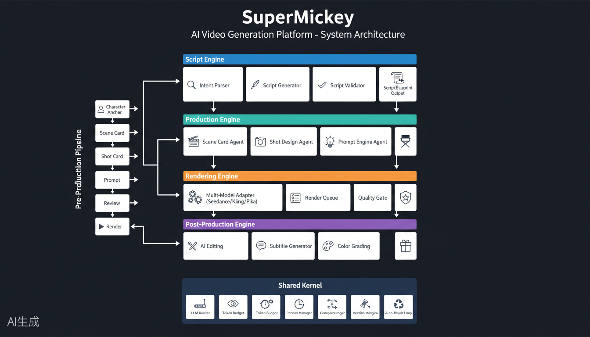
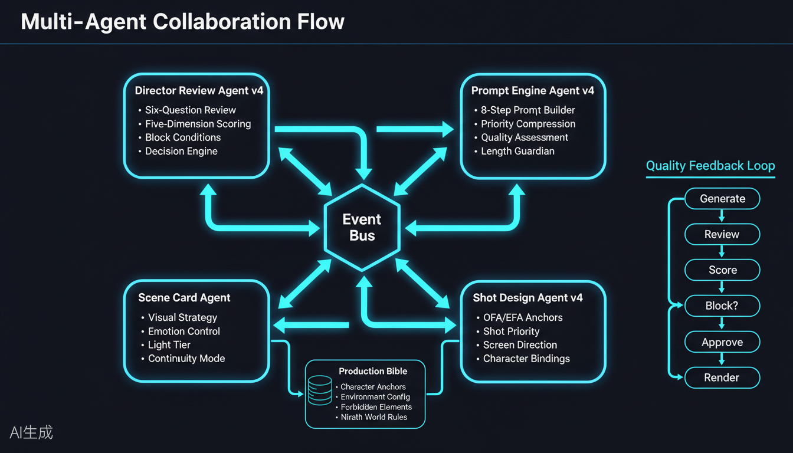
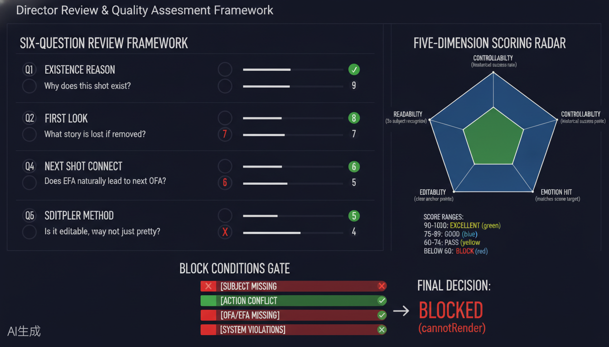
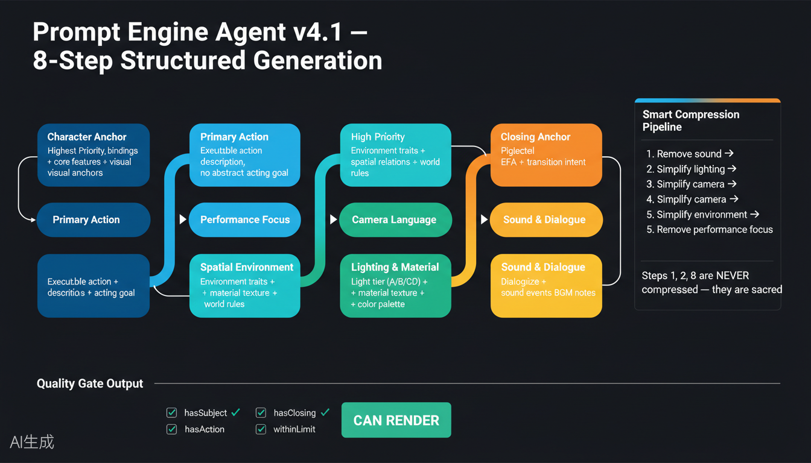
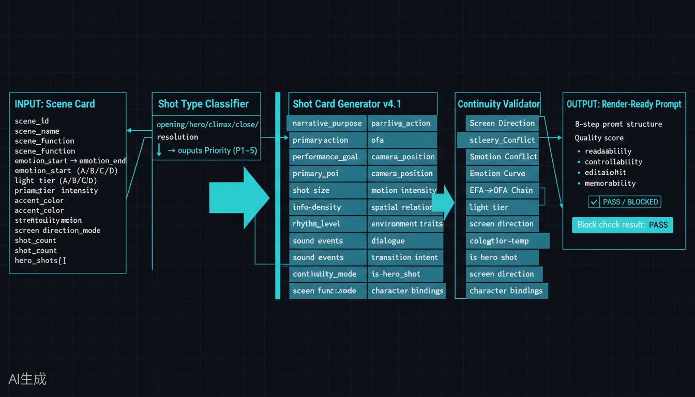

# SuperMickey AI Video Generation System

<p align="center">
  
</p>

<p align="center">
  <b>Enterprise-Grade AI Video Production Pipeline</b><br/>
  <i>From Script to Screen — Fully Automated, Cinema-Quality Video Generation</i>
</p>

<p align="center">
  <a href="#stars"></a>
  <a href="#license"></a>
  <a href="#version"></a>
  <a href="#node"></a>
  <a href="#ai"></a>
</p>

---

## Table of Contents

- [What is SuperMickey?](#what-is-supermickey)
- [Why SuperMickey?](#why-supermickey)
- [System Architecture](#system-architecture)
- [Core Agents](#core-agents)
- [Quick Start (For AI Agents & Humans)](#quick-start)
- [AI Agent Integration Guide](#ai-agent-integration-guide)
- [Field Standards](#field-standards)
- [Configuration](#configuration)
- [Project Structure](#project-structure)
- [API Reference](#api-reference)
- [Roadmap](#roadmap)
- [How to Star & Contribute](#how-to-star--contribute)
- [Changelog](#changelog)
- [License](#license)

---

## What is SuperMickey?

**SuperMickey** is a production-grade AI video generation system that bridges the gap between creative storytelling and automated video production. Originally built for cinematic short-form content creation, it has evolved into a modular, multi-agent pipeline capable of producing high-quality videos from structured story inputs.

The system treats video production as a **software engineering problem** — with strict quality gates, versioned checkpoints, automated reviews, and structured data contracts between every pipeline stage.

> **Built for AI Agents, loved by humans.** Every module is designed to be programmatically discoverable and executable by autonomous agents.

### At a Glance

| Metric | Value |
|--------|-------|
| **Lines of Code** | 206,000+ |
| **Modules** | 787 files |
| **Agent Types** | 4 specialized production agents |
| **Pipeline Stages** | 17+ sequential stages |
| **Field Definitions** | 25+ shot-level fields |
| **Quality Dimensions** | 5-dimension scoring framework |
| **Render Adapters** | Seedance 2.0 (extensible to Kling, Pika, Runway) |

---

## Why SuperMickey?

### The Problem

Most AI video tools give you a text box and pray. Professionals need:
- **Character consistency** across shots
- **Camera continuity** (screen direction, OFA/EFA chains)
- **Emotion arcs** that build across scenes
- **Quality assurance** before rendering costs are sunk
- **Structured output** that can be versioned, diffed, and automated

### The Solution

SuperMickey provides a **complete pre-production pipeline**:

1. **Script Engine** parses your intent into a structured blueprint
2. **Scene Card Agent** designs the visual strategy (light, emotion, color)
3. **Shot Design Agent** breaks scenes into individual shots with 25+ structured fields
4. **Director Review Agent** runs a 6-question review + 5-dimension quality score
5. **Prompt Engine Agent** generates optimized, length-aware render prompts
6. **Render Engine** submits to video generation APIs with full parameter control
7. **Post-Production Engine** assembles, grades, and packages the final output

---

## System Architecture

### 4-Layer Architecture Overview

<p align="center">
  
</p>

### Layer 1: Script Engine

The **single source of truth** for the entire pipeline.

| Component | Purpose |
|-----------|---------|
| `IntentParser` | Classifies narrative mode (dramatic/educational/documentary/commercial) |
| `ScriptGenerator` | Generates structured `ScriptBlueprint` JSON via LLM |
| `ScriptValidator` | Schema + business rule validation |
| `ScriptBlueprint` | Immutable output: characters, scenes, dialogue, world rules |

### Layer 2: Production Engine

The creative core — 4 specialized agents orchestrated via Event Bus.

<p align="center">
  
</p>

### Layer 3: Rendering Engine

| Component | Purpose |
|-----------|---------|
| `MultiModelAdapter` | Unified interface for Seedance/Kling/Pika/Runway |
| `RenderQueue` | Batch submission with rate limiting |
| `QualityGate` | Pre-render validation (prompt length, consistency, compliance) |

### Layer 4: Post-Production Engine

| Component | Purpose |
|-----------|---------|
| `AIEditor` | Automated cutting with hard-cut/fade transitions |
| `SubtitleGenerator` | Dialogue-based subtitle timing and burn-in |
| `ColorGrading` | LUT application and tonal consistency |
| `Packaging` | Title cards, end cards, platform optimization |

### Shared Kernel

Cross-cutting infrastructure:

| Module | Purpose |
|--------|---------|
| `LLMRouter` | Multi-model routing with fallback |
| `TokenBudget` | Prevents API quota exhaustion |
| `ProcessManager` | Engine isolation and crash recovery |
| `VersionManager` | Checkpoint/snapshot at every stage |
| `ComplianceEngine` | Content safety + policy enforcement |
| `AutoRepairLoop` | Self-healing on known failure patterns |

---

## Core Agents

### Agent 1: Director Review Agent v4

<p align="center">
  
</p>

**Purpose**: Automated quality assurance before rendering.

**Six-Question Review Framework**:

| # | Question | Assessment |
|---|----------|------------|
| Q1 | Why does this shot exist? | Narrative purpose validation |
| Q2 | Where does the eye go first? | Primary point of interest check |
| Q3 | What story is lost if deleted? | Hero shot / priority verification |
| Q4 | Does the EFA naturally lead to next OFA? | Continuity chain validation |
| Q5 | Is there a simpler way to shoot? | Efficiency review |
| Q6 | Is it editable, not just pretty? | Post-production readiness |

**Five-Dimension Scoring**:

| Dimension | Description | Weight |
|-----------|-------------|--------|
| Readability | Subject/action recognizable in 3 seconds | 25% |
| Controllability | Historical success rate for this shot type | 20% |
| Editability | Clear anchor points for cutting | 20% |
| Emotion Hit | Matches scene emotion target | 20% |
| Memorability | Has "unforgettable" elements | 15% |

**Block Conditions** (hard stops):
- Missing subject
- Camera/action conflict
- Missing OFA/EFA
- System violations (forbidden elements, character inconsistency)

```javascript
const { DirectorReviewAgentV4 } = require('./agents/director-review-agent-v4');

const agent = new DirectorReviewAgentV4({ model: 'kimi-k2p6' });
const review = await agent.review(shotCard, sceneCard, adjacentShots);

console.log(review.decision.canRender); // true / false
console.log(review.fiveDimensions.totalScore); // 0-100
```

### Agent 2: Prompt Engine Agent v4

<p align="center">
  
</p>

**Purpose**: Generate optimized, length-compliant render prompts.

**8-Step Structured Generation** (priority-ordered):

```
Step 1: Character Anchor     (HIGHEST — NEVER compressed)
Step 2: Primary Action       (HIGHEST — NEVER compressed)
Step 3: Performance Focus    (HIGH)
Step 4: Spatial Environment  (MEDIUM)
Step 5: Camera Language      (MEDIUM)
Step 6: Lighting & Material  (MEDIUM)
Step 7: Sound & Dialogue     (LOWER)
Step 8: Closing Anchor       (HIGH — NEVER compressed)
```

**Smart Compression Pipeline** (triggered when > 988 chars):
1. Remove sound/dialogue
2. Simplify lighting/material
3. Simplify camera language
4. Simplify environment
5. Remove performance focus

> Steps 1, 2, and 8 are sacred — they are never compressed.

```javascript
const { PromptEngineAgentV4 } = require('./agents/prompt-engine-agent-v4');

const agent = new PromptEngineAgentV4();
const result = await agent.generate(shotCard, sceneCard);

console.log(result.renderPrompt);      // Final optimized prompt
console.log(result.quality.score);     // Quality score 0-100
console.log(result.charCount);         // Character count
console.log(result.compressionLog);    // What was compressed
```

### Agent 3: Scene Card Agent

**Purpose**: Upstream visual/emotional strategy for entire scenes.

**Output Fields**:

| Field | Description |
|-------|-------------|
| `scene_function` | establish / advance / conflict / reveal / resolve |
| `emotion_start` → `emotion_end` | Emotional arc |
| `light_tier` | A (bright) / B (mystery) / C (contrast) / D (divine) |
| `primary_palette` + `accent_color` | Color strategy |
| `screen_direction` | Consistent screen movement |
| `continuity_mode` | strict / soft / none |
| `shot_count` | Recommended 3-8 shots |
| `hero_shots` | Identified hero shot positions |

### Agent 4: Shot Design Agent v4

<p align="center">
  
</p>

**Purpose**: Generate individual shot cards from scene cards.

**25 Structured Fields per Shot**:

```javascript
// Core Identity
shot_id, scene_id, shot_type, priority, is_hero_shot

// Narrative
narrative_purpose, primary_action, performance_goal

// Visual Anchors
ofa (Opening Frame Anchor), efa (Ending Frame Anchor), primary_poi

// Camera
shot_size, camera_position, camera_movement, motion_intensity

// Rhythm
rhythm_level, info_density, duration

// Space
spatial_relation, environment_traits, screen_direction

// Audio
dialogue, sound_events

// System
light_tier, color_temp, transition_intent, continuity_mode
character_bindings, scene_function
```

---

## Quick Start

### Prerequisites

```bash
# Node.js 24+ (required for native fetch, structuredClone)
node --version  # >= 24.0.0

# API Keys (set as environment variables)
export LLM_API_KEY="your-llm-key"
export SEEDANCE_API_KEY="your-seedance-key"
```

### Installation

```bash
git clone https://github.com/geniusdapeng-collab/super-mickey.git
cd super-mickey
npm install
```

### Run a Complete Pre-Production Pipeline

```bash
# Create a story input
mkdir -p stories
cat > stories/my-story.json << 'EOF'
{
  "title": "Mountain Adventure",
  "narrative_mode": "dramatic",
  "target_duration": 60,
  "target_platform": ["youtube", "tiktok"],
  "language": "en-US",
  "style_tags": ["cinematic", "epic", "hyper-realistic"],
  "protagonist": "alex",
  "plot": "A mountaineer faces a sudden storm and must find shelter",
  "scenes": [
    {
      "scene_name": "The Ascent",
      "location": "rocky mountain trail",
      "characters": ["alex"],
      "plot": "Alex climbs steadily, enjoying the view",
      "emotion_target": "wonder"
    },
    {
      "scene_name": "The Storm",
      "location": "mountain ridge",
      "characters": ["alex"],
      "plot": "Dark clouds gather, wind intensifies",
      "emotion_target": "fear"
    }
  ]
}
EOF

# Run pre-production
node app/cli.js preproduction --input stories/my-story.json

# Output will be in ./output/ with:
# - scene-cards/ (visual strategy per scene)
# - shot-cards/ (individual shot designs)
# - prompts/ (render-ready prompts)
# - reviews/ (director review reports)
```

### Programmatic Usage (Agent-Friendly)

```javascript
const { SceneCardAgent } = require('./agents/scene-card-agent');
const { ShotDesignAgentV4 } = require('./agents/shot-design-agent-v4');
const { PromptEngineAgentV4 } = require('./agents/prompt-engine-agent-v4');
const { DirectorReviewAgentV4 } = require('./agents/director-review-agent-v4');

// Step 1: Generate Scene Card
const sceneAgent = new SceneCardAgent();
const sceneCard = await sceneAgent.generate({
  sceneName: 'The Storm',
  location: 'mountain ridge',
  characters: ['alex'],
  plot: 'Dark clouds gather, wind intensifies',
  emotionTarget: 'fear',
  duration: 20
});

// Step 2: Approve Scene Card
sceneAgent.approve(sceneCard);

// Step 3: Generate Shot Cards
const shotAgent = new ShotDesignAgentV4();
const shots = await shotAgent.generateShots(sceneCard);

// Step 4: Generate Prompts
const promptAgent = new PromptEngineAgentV4();
for (const shot of shots) {
  const result = await promptAgent.generate(shot, sceneCard);
  console.log(`Shot ${shot.shot_id}: ${result.charCount} chars, quality: ${result.quality.score}`);
}

// Step 5: Director Review
const director = new DirectorReviewAgentV4();
for (let i = 0; i < shots.length; i++) {
  const review = await director.review(shots[i], sceneCard, [
    shots[i-1], shots[i+1]
  ].filter(Boolean));
  console.log(`Shot ${shots[i].shot_id}: ${review.status}`);
}
```

---

## AI Agent Integration Guide

> **This section is specifically designed for AI Agents** (Claude, GPT-4, Cursor, Devin, etc.) that want to use SuperMickey as a video generation backend.

### Agent Discovery Protocol

SuperMickey exposes structured metadata for agent discovery:

```bash
# Get system capabilities
curl http://localhost:3000/api/capabilities

# Response:
{
  "system": "SuperMickey",
  "version": "6.5.53",
  "agents": ["scene-card", "shot-design", "prompt-engine", "director-review"],
  "render_engines": ["seedance-2.0"],
  "max_prompt_length": 988,
  "supported_fields": 25,
  "quality_dimensions": 5,
  "continuity_modes": ["strict", "soft", "none"],
  "light_tiers": ["A", "B", "C", "D"]
}
```

### MCP (Model Context Protocol) Integration

```javascript
// mcp-server.js - Expose SuperMickey as MCP tools
const { Server } = require('@modelcontextprotocol/sdk');

const server = new Server({
  name: "supermickey",
  version: "6.5.53"
});

// Tool: Generate Scene Card
server.registerTool("generate_scene_card", {
  description: "Generate a visual strategy scene card from story input",
  parameters: {
    sceneName: { type: "string" },
    location: { type: "string" },
    characters: { type: "array", items: { type: "string" } },
    plot: { type: "string" },
    emotionTarget: { type: "string" }
  },
  handler: async (params) => {
    const agent = new SceneCardAgent();
    return await agent.generate(params);
  }
});

// Tool: Generate Shot Cards
server.registerTool("generate_shot_cards", {
  description: "Generate shot cards from an approved scene card",
  parameters: {
    sceneCard: { type: "object" }
  },
  handler: async (params) => {
    const agent = new ShotDesignAgentV4();
    return await agent.generateShots(params.sceneCard);
  }
});

// Tool: Generate Render Prompt
server.registerTool("generate_prompt", {
  description: "Generate optimized render prompt from shot card",
  parameters: {
    shotCard: { type: "object" },
    sceneCard: { type: "object" }
  },
  handler: async (params) => {
    const agent = new PromptEngineAgentV4();
    return await agent.generate(params.shotCard, params.sceneCard);
  }
});

// Tool: Director Review
server.registerTool("director_review", {
  description: "Run director quality review on a shot",
  parameters: {
    shotCard: { type: "object" },
    sceneCard: { type: "object" },
    adjacentShots: { type: "array" }
  },
  handler: async (params) => {
    const agent = new DirectorReviewAgentV4();
    return await agent.review(
      params.shotCard,
      params.sceneCard,
      params.adjacentShots
    );
  }
});
```

### Automated Workflow (Agent-Ready)

```javascript
// complete-pipeline.js - Full autonomous pipeline
const fs = require('fs');

async function runAutonomousPipeline(storyInput) {
  const results = {
    sceneCards: [],
    shotCards: [],
    prompts: [],
    reviews: [],
    approved: []
  };

  // Phase 1: Scene Cards
  const sceneAgent = new SceneCardAgent();
  for (const scene of storyInput.scenes) {
    const card = await sceneAgent.generate(scene);
    sceneAgent.approve(card, 'Auto-approved by agent');
    results.sceneCards.push(card);
  }

  // Phase 2: Shot Design
  const shotAgent = new ShotDesignAgentV4();
  for (const sceneCard of results.sceneCards) {
    const shots = await shotAgent.generateShots(sceneCard);
    results.shotCards.push(...shots);
  }

  // Phase 3: Prompt Generation + Director Review
  const promptAgent = new PromptEngineAgentV4();
  const director = new DirectorReviewAgentV4();

  for (let i = 0; i < results.shotCards.length; i++) {
    const shot = results.shotCards[i];
    const scene = results.sceneCards.find(s => s.scene_id === shot.scene_id);
    
    // Generate prompt
    const prompt = await promptAgent.generate(shot, scene);
    results.prompts.push(prompt);
    
    // Director review
    const adjacent = [results.shotCards[i-1], results.shotCards[i+1]].filter(Boolean);
    const review = await director.review(shot, scene, adjacent);
    results.reviews.push(review);
    
    if (review.decision.canRender) {
      results.approved.push({
        shot_id: shot.shot_id,
        prompt: prompt.renderPrompt,
        quality: prompt.quality.score,
        review_score: review.fiveDimensions.totalScore
      });
    }
  }

  // Save checkpoint
  fs.writeFileSync('pipeline-checkpoint.json', JSON.stringify(results, null, 2));
  
  return {
    total: results.shotCards.length,
    approved: results.approved.length,
    avg_quality: results.reviews.reduce((s, r) => s + r.fiveDimensions.totalScore, 0) / results.reviews.length,
    ready_to_render: results.approved
  };
}
```

---

## Field Standards

### Shot Card v4.1 Field Specification

Every shot in SuperMickey is defined by **25 structured fields**. This standard enables:
- Cross-model compatibility
- Automated quality scoring
- Continuity validation
- Agent-to-agent communication

| # | Field | Type | Priority | Description |
|---|-------|------|----------|-------------|
| 1 | `shot_id` | string | required | Unique identifier (SC01-S01) |
| 2 | `scene_id` | string | required | Parent scene reference |
| 3 | `narrative_purpose` | string | required | Why this shot exists |
| 4 | `primary_action` | string | required | Main character action |
| 5 | `performance_goal` | string | required | Emotional acting target |
| 6 | `ofa` | string | required | Opening Frame Anchor |
| 7 | `efa` | string | required | Ending Frame Anchor |
| 8 | `primary_poi` | string | required | First visual focus |
| 9 | `shot_size` | enum | required | wide/medium/close_up/extreme_close_up |
| 10 | `camera_position` | string | required | Camera placement |
| 11 | `camera_movement` | string | required | Specific movement description |
| 12 | `motion_intensity` | int(1-5) | required | Movement intensity level |
| 13 | `rhythm_level` | enum | required | 静/缓/中/快/爆发 |
| 14 | `info_density` | enum | required | 极简/低/中/高/极高 |
| 15 | `spatial_relation` | string | required | Character-space relationship |
| 16 | `environment_traits` | string | required | Key environment elements |
| 17 | `dialogue` | string | optional | Character dialogue |
| 18 | `sound_events` | string | optional | Key sound descriptions |
| 19 | `transition_intent` | string | required | How to connect to next shot |
| 20 | `light_tier` | enum(A-D) | required | Lighting tier |
| 21 | `screen_direction` | string | required | Screen movement direction |
| 22 | `continuity_mode` | enum | required | strict/soft/none |
| 23 | `shot_type` | enum | required | opening/hero/climax/close/building |
| 24 | `priority` | enum(P1-P5) | required | Shot priority |
| 25 | `character_bindings` | string | required | Character anchor features |

### Light Tier System

| Tier | Name | Use Case |
|------|------|----------|
| **A** | Bright Exploration | Discovery, wonder, journey |
| **B** | Mystery Low-Light | Suspense, unknown, tension |
| **C** | Contrast High | Conflict, drama, action |
| **D** | Divine Presence | Revelation, climax, sacred |

### Priority System

| Priority | Type | Retry Strategy |
|----------|------|----------------|
| **P1** | Hero Shot | Must succeed — max retries |
| **P2** | Key Narrative | High retry count |
| **P3** | Supporting | Standard retry |
| **P4** | Transition | Low retry, can simplify |
| **P5** | Replaceable | Skip if fails |

---

## Configuration

### Production Bible

The `ProductionBible` is the central knowledge base for your project:

```javascript
// config/production-bible.json
{
  "project": {
    "name": "Mountain Adventure",
    "style": "cinematic documentary",
    "aspect_ratio": "16:9",
    "resolution": "1080p"
  },
  "characters": {
    "alex": {
      "name": "Alex Chen",
      "role": "protagonist",
      "anchorFeatures": ["short black hair", "hiking gear", "determined eyes"],
      "reference_images": ["characters/alex/front.jpg"]
    }
  },
  "environment": {
    "mountain_trail": {
      "name": "Rocky Mountain Trail",
      "spatialKeywords": ["narrow path", "steep rocks", "loose gravel"],
      "palette": { "primary": "gray-brown", "accent": "green", "forbidden": ["neon"] }
    }
  },
  "forbidden": ["text", "watermark", "logo", "extra limbs", "distorted"]
}
```

### Prompt Length Configuration

```javascript
// config/prompt-length.json
{
  "TARGET_MIN": 300,
  "TARGET_MAX": 850,
  "HARD_MAX": 988,
  "getStatus": (count) => count <= 850 ? 'optimal' : count <= 988 ? 'compressed' : 'overflow'
}
```

---

## Project Structure

```
supermickey/
├── agents/                          # Specialized AI agents
│   ├── director-review-agent-v4.js  # Quality assurance agent
│   ├── prompt-engine-agent-v4.js    # Prompt generation agent
│   ├── scene-card-agent.js          # Visual strategy agent
│   └── shot-design-agent-v4.js      # Shot design agent
├── app/                             # CLI and commands
│   ├── cli.js                       # Entry point
│   └── commands/
│       └── preproduction.js         # Full pipeline command
├── architecture-v2/                 # Interface contracts
│   └── interface-contract-v1.md     # 4-layer architecture spec
├── characters/                      # Character reference images
│   └── {character}/
│       └── portraits/
├── checkpoints/                     # Pipeline state snapshots
├── config/                          # Configuration
│   ├── production-bible.js          # Project knowledge base
│   └── prompt-length.json           # Length constraints
├── engines/                         # Future engine modules
│   ├── script-engine/               # (v7.0) Script generation
│   ├── production-engine/           # (v7.0) Shot production
│   ├── rendering-engine/            # (v7.0) Multi-model render
│   └── post-production-engine/      # (v7.0) Assembly & grading
├── shared-kernel/                   # Future shared infrastructure
│   ├── llm-router.js
│   ├── token-budget.js
│   ├── version-manager.js
│   └── compliance-engine.js
├── systems/                         # Core systems
│   ├── llm-reasoning-engine.js      # LLM abstraction layer
│   ├── production-bible.js          # Knowledge base loader
│   ├── light-tier.js                # Lighting classification
│   ├── quality-scorer.js            # 5-dimension scoring
│   ├── continuity-manager.js        # Shot continuity
│   ├── prompt-guardian.js           # Auto prompt repair
│   └── preproduction-service.js     # Full pipeline orchestrator
├── templates/                       # Output templates
│   ├── scene-card-template.md
│   ├── shot-card-v4-template.md
│   └── director-review-form.md
├── stories/                         # Story inputs
├── output/                          # Generated outputs
└── CHANGELOG.md
```

---

## API Reference

### SceneCardAgent

```javascript
const { SceneCardAgent } = require('./agents/scene-card-agent');
const agent = new SceneCardAgent(options);

// Generate
const sceneCard = await agent.generate(storyInput, options);

// Approve (required before shot generation)
agent.approve(sceneCard, directorNotes);

// Validate
const validation = agent.validateForShotCard(sceneCard);
// → { valid: true } or { valid: false, missing: [...] }
```

### ShotDesignAgentV4

```javascript
const { ShotDesignAgentV4 } = require('./agents/shot-design-agent-v4');
const agent = new ShotDesignAgentV4(options);

// Generate all shots for a scene
const shots = await agent.generateShots(sceneCard, storyBeats);

// Check blocking conditions
const blocks = agent.checkBlocking(shots);
```

### PromptEngineAgentV4

```javascript
const { PromptEngineAgentV4 } = require('./agents/prompt-engine-agent-v4');
const agent = new PromptEngineAgentV4(options);

// Generate prompt
const result = await agent.generate(shotCard, sceneCard);

// Result structure:
{
  renderPrompt,      // Final optimized prompt string
  charCount,         // Character count
  targetMin,         // 300
  targetMax,         // 850
  maxChars,          // 988
  lengthStatus,      // 'optimal' | 'compressed' | 'overflow'
  compressionLog,    // Array of compression steps
  quality: {
    score,           // 0-100
    checks,          // Individual check results
    assessment,      // 'good' | 'pass' | 'needs improvement'
    canRender        // Boolean
  },
  promptData         // Structured 8-step data
}
```

### DirectorReviewAgentV4

```javascript
const { DirectorReviewAgentV4 } = require('./agents/director-review-agent-v4');
const agent = new DirectorReviewAgentV4(options);

// Review a shot
const review = await agent.review(shotCard, sceneCard, adjacentShots);

// Result structure:
{
  shot_id,
  sixQuestions,           // Q1-Q6 with scores and pass/fail
  sixQuestionsTotal,      // Sum of Q scores
  fiveDimensions: {
    dimensions: {
      readability: { score, weight, weighted },
      controllability: { score, weight, weighted },
      editability: { score, weight, weighted },
      emotionHit: { score, weight, weighted },
      memorability: { score, weight, weighted }
    },
    totalScore,            // 0-100
    grade                  // { label: 'excellent'|'good'|'pass'|'fail' }
  },
  blockCheck: {
    blocked,               // Boolean
    blocks                 // Array of blocking issues
  },
  decision: {
    canRender,             // Boolean
    needsDirectorConfirm,  // Boolean
    directorNotes,         // String
    modificationSuggestions // Array
  },
  status                  // 'approved' | 'blocked'
}
```

---

## How to Star & Contribute

### Show Your Support

If SuperMickey helps your video production workflow, please consider:

**Starring the repo** — It helps other developers and AI agents discover this project.

```bash
# If using as a dependency, credit in your README
# If building on top, reference the architecture
# If reporting issues, include your checkpoint JSON
```

### Contribution Guidelines

1. **Fork** the repository
2. **Create** a feature branch (`git checkout -b feature/amazing`)
3. **Commit** with clear messages
4. **Push** to your fork
5. **Open** a Pull Request

### Areas Needing Contributors

| Area | Skill Level | Description |
|------|-------------|-------------|
| Render Adapters | Intermediate | Add Kling/Pika/Runway adapters |
| MCP Tools | Intermediate | Expand MCP tool coverage |
| Documentation | Beginner | Translation, examples, tutorials |
| Quality Benchmarks | Advanced | Build evaluation datasets |
| Template Library | Beginner | Create scene templates |

---

## Changelog

### v6.5.53 (2026-06-29)
- Pre-release: Core code packaging for open source
- All 4 agents production-ready
- 25-field shot card standard finalized
- Interface contracts for v7.0 defined

### v6.5.0 (2026-06-25)
- CLI entry point with pre-production command
- Checkpoint persistence (phase1/phase2/phase3)
- Process guard for crash recovery

### v6.2.x (2026-05)
- Smart prompt compression pipeline
- Vertical reading format for mobile review
- Sensitive content detection and handling
- Prompt truncation at punctuation

### v2.1.2 (2026-06-20)
- Sound description system (SFX, ambience, BGM)
- Multi-shot timestamp detection
- Negative prompt support
- Seed value locking
- Cost optimization strategies

### v2.1.0 (2026-06-20)
- PromptGuardian auto-repair system
- Character appearance anchor system
- Reference format auto-correction

---

## License

MIT License — see [LICENSE](LICENSE) for details.

---

<p align="center">
  <b>SuperMickey</b> — Built for the age of AI-generated cinema.<br/>
  <i>If you can script it, we can film it.</i>
</p>

<p align="center">
  <a href="https://github.com/geniusdapeng-collab/super-mickey">Star us on GitHub</a> ·
  <a href="https://discord.gg/supermickey">Join Discord</a> ·
  <a href="https://twitter.com/supermickey">Follow on X</a>
</p>
